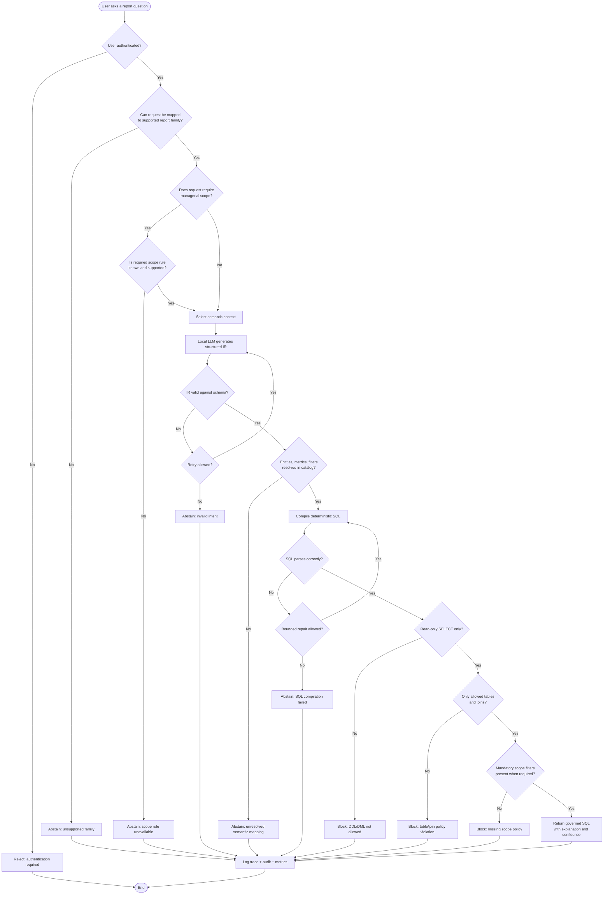

# SQL Generation and Validation Flow

This document describes the decision logic for safe SQL generation, validation, blocking and abstention.

## Mandatory validation rules

The system must block or abstain when:

- user is unauthenticated;
- report family is unsupported;
- scoping rule is required but unavailable;
- structured intent is invalid;
- semantic mapping cannot be resolved;
- SQL compilation fails;
- SQL is not read-only;
- SQL contains DDL/DML;
- SQL references tables or joins outside the allowlist;
- mandatory scope filters are missing.

## Safe failure principle

A failed validator should not leak unsafe SQL to the user. The expected behavior is controlled refusal with a reason that is useful but does not reveal an unsafe candidate.
