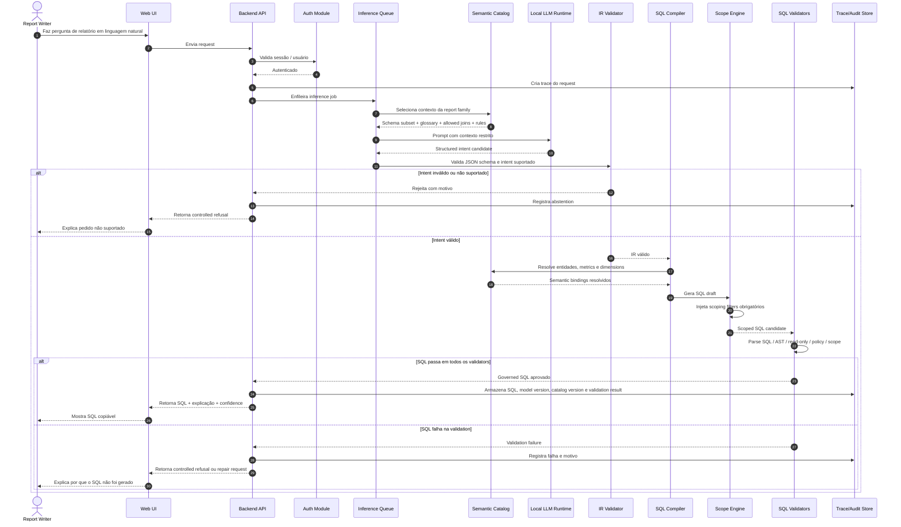

# Runtime Flow

Este documento descreve o comportamento end-to-end em runtime quando um report writer faz uma pergunta em linguagem natural.

## Comportamento em runtime

1. O usuário envia um request em linguagem natural.
2. O backend autentica a sessão.
3. O request recebe trace.
4. O inference job entra na queue.
5. O context selector identifica a report family e o semantic subset relevantes.
6. O local LLM gera structured intent candidate.
7. O IR validator verifica JSON schema e intent suportado.
8. O SQL compiler gera SQL a partir de IR válido.
9. O scope engine injeta filters obrigatórios.
10. Validators checam SQL safety, policy e scope.
11. O app retorna governed SQL ou controlled refusal.
12. Trace/audit information é armazenada.

## Non-goals em runtime

- O produto não executa SQL.
- O produto não conecta ao production DB.
- O produto não chama cloud LLM APIs.
- O produto não contorna o AutoTime external Report Writer.
