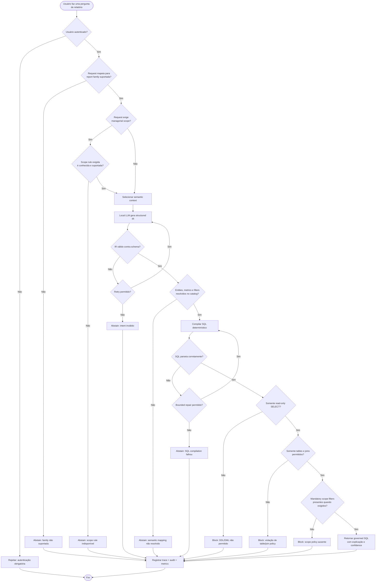

# SQL Generation e Validation Flow

Este documento descreve a lógica de decisão para geração segura de SQL, validation, blocking e abstention.

## Regras obrigatórias de validation

O sistema deve bloquear ou abster quando:

- usuário não estiver autenticado;
- report family não for suportada;
- scope rule for exigida, mas estiver indisponível;
- structured intent for inválido;
- semantic mapping não puder ser resolvido;
- SQL compilation falhar;
- SQL não for read-only;
- SQL contiver DDL/DML;
- SQL referenciar tables ou joins fora da allowlist;
- mandatory scope filters estiverem ausentes.

## Princípio de safe failure

Um validator com falha não deve vazar SQL inseguro para o usuário. O comportamento esperado é controlled refusal com um motivo útil, mas sem revelar um unsafe candidate.
