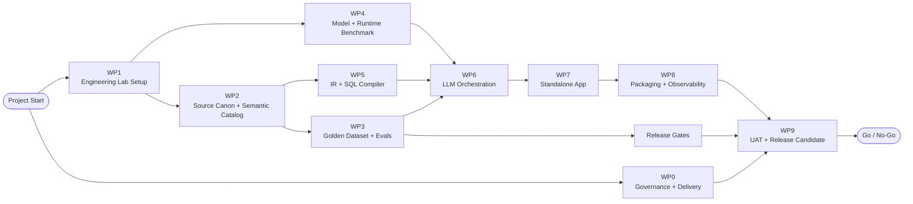

# 8-Week Delivery Plan

The compressed 8-week plan should be positioned as a **Working Product with engineering evidence**, not as a fully hardened enterprise platform.

## Engineering Workstream Map

## What we reduce versus a 12-week plan

The 8-week version reduces:

- formal mobilization and project charter effort;
- broad model/runtime benchmark;
- enterprise authentication scope;
- packaging depth;
- UAT duration;
- documentation breadth;
- hardening for many customer topologies.

It should not reduce:

- lab setup;
- semantic catalog;
- golden dataset;
- eval harness;
- structured IR;
- deterministic SQL compiler;
- SQL validators;
- scoping engine.

## Week-by-week plan

| Week | Focus | Main outputs |
|---:|---|---|
| 1 | Kickoff, lab, demo DB, source collection | Lab ready, DB restored, technical plan |
| 2 | Semantic catalog, first golden cases | Catalog v0, test case format |
| 3 | Eval harness, benchmark, IR draft | Eval v0, benchmark baseline, IR schema |
| 4 | Runtime decision, SQL compiler v0 | Model/runtime decision, compiler first cut |
| 5 | Scoping, guardrails, app skeleton | Scope engine, validators, backend/UI skeleton |
| 6 | Integrated NL to IR to SQL flow | End-to-end governed SQL generation |
| 7 | Packaging, concurrency, regression | Deployment kit draft, load tests, bug fixing |
| 8 | UAT, release candidate, handover | UAT report, eval report, release candidate |

## Work packages

| WP | Name | Main owner | Duration |
|---|---|---|---|
| WP0 | Governance and delivery setup | Erlon | Days 1-2 |
| WP1 | Engineering lab setup | Fabio | Week 1 |
| WP2 | Source canon and semantic catalog | Marcos | Weeks 1-2 |
| WP3 | Golden dataset and eval harness | Marcos/Persival | Weeks 2-3 |
| WP4 | Model/runtime benchmark | Persival | Weeks 2-4 |
| WP5 | IR, semantic layer and SQL compiler | Marcos | Weeks 3-6 |
| WP6 | LLM orchestration and guardrails | Persival | Weeks 4-6 |
| WP7 | Standalone app and auth | Fabio | Weeks 5-7 |
| WP8 | Packaging and observability | Fabio | Weeks 6-8 |
| WP9 | UAT, release candidate and handover | Erlon | Week 8 |

## Minimum Release Candidate Criteria

A release candidate should not be declared unless:

- app runs standalone in supported environment;
- local model runtime works without cloud dependency;
- Labor Charge and Employee families are supported;
- SQL is generated through IR + compiler path;
- validators block DDL/DML and unsafe operations;
- scope rules are applied when required;
- golden dataset runs end-to-end;
- eval report is generated;
- installation smoke test passes;
- UAT has been executed with AutoTime SME;
- known limitations are documented.
