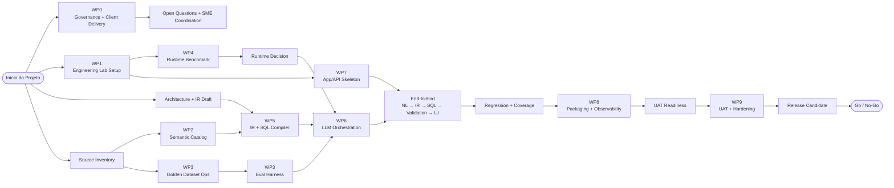

# Plano de Entrega de 10 Semanas

O plano oficial de entrega tem 10 semanas e quatro trilhas simétricas: Erlon em client/evidence/UAT, Marcos em data/SQL/compiler, Persival em AI architecture/runtime/guardrails e Fábio em platform/app/deployment.

O plano de 10 semanas equilibra prazo, carga de trabalho freelancer e qualidade técnica, mantendo quatro trilhas paralelas com ownership claro.

## Caminho crítico e justificativa das 10 semanas

O relógio das semanas críticas não é controlado pela Iania: catalog, golden dataset e scope engine dependem de insumos e validações do AutoTime (demo DB, report examples, SME scoping session, throughput de validação do SME). O buffer do plano está posicionado onde está a variabilidade — nas dependências externas (critical chain).

A qualidade em enterprise Text-to-SQL vem de ciclos de failure taxonomy → correção → re-eval (DIN-SQL, DAIL-SQL, BIRD), e cada ciclo consome calendário, não apenas esforço. O plano garante dois ciclos completos de regressão (S6–S7 e S8→S9).

As quatro trilhas já são paralelas desde a S1: comprimir o calendário não cria paralelismo novo — o gargalo é sequencial (IR → compiler → e2e → regressão) e externo (SME). O plano de 10 semanas já é a versão comprimida: os cortes permitidos (ceremony, benchmark amplo, UX polish) já foram feitos; evals, golden dataset e validators não se cortam.

## Mapeamento com os milestones externos (Annex v1.2)

| Milestone externo | Semana interna | Significado |
|---|---:|---|
| M1 | S4 | Runtime/model decision + IR v1 |
| M2 | S6 | Primeiro fluxo end-to-end NL → IR → SQL → validation → UI |
| M3 — Pronto para Piloto | S8 | Working application + deployment kit + smoke tests |
| Go / No-Go | S10 | Release candidate + evidence pack + handover |

As semanas 9–10 são o **Sprint conjunto de UAT & Hardening**, com participação do SME do AutoTime. O marco externo de 8 semanas permanece (M3); as 2 semanas adicionais são um estágio de qualidade, não dilatação.

Ver também [Mapeamento Interno ↔ Cliente](../01-contexto-produto/mapeamento-cliente.md) para o vocabulário completo usado com o AutoTime.

## Workstream Map

## Plano semana a semana

| Semana | Foco | Output principal |
|---:|---|---|
| 1 | Kickoff, lab, arquitetura v0, source inventory | Lab iniciado + plano técnico |
| 2 | Semantic skeleton, IR draft, golden template, app skeleton | Catalog v0 + IR draft |
| 3 | Golden cases, eval harness, benchmark, API mock | Eval v0 + benchmark iniciado |
| 4 | Runtime decision, IR v1, compiler spike, auth scaffold | Runtime decision + IR v1 |
| 5 | Compiler v0, scoping, NL→IR, UI funcional | SQL compiler v0 + scope v0 |
| 6 | End-to-end inicial e evals técnicos | NL→IR→SQL→validation→UI |
| 7 | Cobertura, regressão, packaging draft | Regression report + package draft |
| 8 | Deployment kit, concorrência, UAT readiness | UAT package + smoke tests **(M3 — Pronto para Piloto)** |
| 9 | Sprint conjunto de UAT & Hardening (parte 1/2) | UAT findings + correções críticas |
| 10 | Sprint conjunto de UAT & Hardening (parte 2/2) — release candidate e handover | RC + reports + go/no-go |

## Ownership simétrico

“Simétrico” significa simetria de ownership e responsabilidade no plano, não que todos farão exatamente as mesmas tarefas ou terão o mesmo tipo de atividade.

| Bloco | Owner | Peso conceitual |
|---|---|---:|
| Client, QA, UAT, Evidence | Erlon | 25% |
| Data, SQL, Catalog, Compiler | Marcos | 25% |
| AI Architecture, IR, Runtime, Guardrails | Persival | 25% |
| Platform, App, Deployment, Observability | Fábio | 25% |

## Responsabilidades por pessoa

### Erlon Rachi — Client Delivery + Golden Dataset Ops + UAT

Responsável por relacionamento com AutoTime, agenda com Cole, Harold e SMEs, controle de insumos, source inventory, matriz de rastreabilidade, decision log, risk log, gestão operacional do golden dataset, UAT script, QA funcional, issue triage, evidence pack, release notes e handover.

Erlon reduz ruído operacional para o time técnico e transforma insumos, validações, riscos, decisões e aceite em um fluxo controlado.

### José Marcos Ferreira — Data/SQL Engineering

Responsável por apoio no restore e inspeção do demo DB, schema analysis, table/field mapping, join mapping, SQL esperado, semantic catalog técnico, SQL compiler, scope SQL logic, validators SQL junto com Persival e execução técnica dos evals.

Marcos garante que a solução respeite a realidade do schema AutoTime e que o SQL produzido seja tecnicamente correto, validável e mensurável.

### Persival Ballesté — AI Architecture + Technical Quality

Responsável por arquitetura da solução, IR schema, intent taxonomy, eval strategy, model/runtime benchmark, prompt/structured output, guardrails, abstention logic, quality gates, architecture decision records e technical go/no-go.

Persival garante que a solução não seja uma LLM solta gerando SQL, mas um sistema governado com IR, compiler, guardrails, evals e critérios claros de qualidade.

### Fábio Sarmento — Platform + Fullstack + Deployment

Responsável por engineering lab, ambientes, backend API, frontend/UI, auth local, fila de inferência, integração com runtime LLM, observability, packaging, smoke tests técnicos e deployment kit.

Fábio transforma a arquitetura em um produto executável, instalável, observável e validável em ambiente on-premise.

## Plano detalhado por semana e por pessoa

### Semana 1 — Kickoff, lab e organização inicial

| Pessoa | Atividades |
|---|---|
| Erlon | Kickoff, RACI, risk log, decision log, agenda com AutoTime, checklist de insumos, source inventory inicial |
| Marcos | Apoio no restore do demo DB, inspeção inicial de schema, identificação de tabelas críticas, leitura de reports exemplo |
| Persival | Arquitetura inicial, princípios de design, definição preliminar de IR, eval strategy inicial, critérios de aceite técnico |
| Fábio | Setup do lab, repositório técnico, ambiente local, scripts iniciais, infraestrutura para demo DB e runtime experiments |

Output: lab iniciado, plano técnico refinado, insumos mapeados, riscos iniciais registrados e arquitetura v0 definida.

### Semana 2 — Source canon, semantic skeleton e golden dataset

| Pessoa | Atividades |
|---|---|
| Erlon | Source inventory completo, matriz fonte → requisito → caso de teste, template do golden dataset, agenda SME |
| Marcos | Source canon técnico, mapeamento inicial de tabelas/campos/joins, catalog v0 para Labor Charge e Employee |
| Persival | IR schema draft, intent taxonomy, métricas de eval, failure taxonomy, critérios de abstenção |
| Fábio | Lab estabilizado, estrutura de app skeleton, healthcheck técnico, pipeline mínimo de execução local |

Output: catalog v0, golden dataset template, IR draft, source traceability v0 e app skeleton técnico.

### Semana 3 — Golden cases, eval harness e benchmark inicial

| Pessoa | Atividades |
|---|---|
| Erlon | Curadoria dos primeiros casos, coleta de perguntas com cliente/SME, classificação por família/complexidade/status |
| Marcos | SQL esperado dos primeiros casos, validação contra demo DB, primeiros exemplos de scoping |
| Persival | Eval harness design, benchmark subset, shortlist de modelos/runtimes, prompt pack v0 |
| Fábio | Benchmark environment, integração inicial com llama.cpp/vLLM, backend API mock, storage de logs |

Output: golden dataset v0 parcial, eval harness v0, runtime benchmark iniciado, primeiras queries esperadas e API mock.

### Semana 4 — Decisão de runtime, IR v1 e compiler spike

| Pessoa | Atividades |
|---|---|
| Erlon | Runtime decision review, decision log, preparação da primeira sessão de validação com SME, baseline report inicial |
| Marcos | Compiler spike, mapeamento de métricas/dimensões/filtros, join rules, SQL templates iniciais |
| Persival | Decisão de runtime/model, IR v1, validator contract, guardrail strategy, architecture decision record |
| Fábio | Integração com runtime escolhido, API contract, fila simples, auth local scaffold |

Output: runtime/model decision, IR v1, compiler spike, validator contract e auth/app scaffold.

### Semana 5 — Compiler v0, scoping e LLM orchestration

| Pessoa | Atividades |
|---|---|
| Erlon | SME scoping session, atualização da matriz de rastreabilidade, QA funcional inicial, controle de pendências |
| Marcos | SQL compiler v0, scope SQL logic, expected SQL expansion, testes de joins e filtros obrigatórios |
| Persival | NL → IR orchestration, structured output, retries controlados, abstention logic, guardrails v0 |
| Fábio | Integração app → backend → runtime, request history, audit log inicial, UI funcional simples |

Output: SQL compiler v0, scope engine v0, NL → IR funcionando, UI/API funcional simples e scoping validado parcialmente.

### Semana 6 — Fluxo end-to-end inicial

| Pessoa | Atividades |
|---|---|
| Erlon | Regression tracking, QA funcional, bug triage, UAT script draft, evidence pack parcial |
| Marcos | Hardening do compiler, SQL expected set, validators SQL, execução de evals técnicos |
| Persival | Integração guardrails + compiler, quality gates v0, review técnico do fluxo end-to-end |
| Fábio | Integração end-to-end, observability básica, fila/timeouts, melhorias UI/API |

Output: primeiro fluxo real NL → IR → SQL → validation → UI, evals rodando, bugs classificados, UAT script draft e observability inicial.

### Semana 7 — Expansão de cobertura e regressão

| Pessoa | Atividades |
|---|---|
| Erlon | Acompanhamento dos casos, organização de UAT, matriz de bugs, follow-up cliente/SME |
| Marcos | Expansão dos casos Labor Charge/Employee, scoping hardening, correções do compiler |
| Persival | Prompt/IR tuning, guardrails hardening, análise de failure taxonomy, quality gate review |
| Fábio | Packaging draft, smoke tests técnicos, concurrency test harness, auth/history refinements |

Output: maior cobertura do golden dataset, compiler mais estável, packaging draft, smoke tests iniciais e regression report.

### Semana 8 — Packaging, concorrência e UAT readiness

| Pessoa | Atividades |
|---|---|
| Erlon | UAT readiness review, agenda UAT, checklists, release notes draft, known limitations draft |
| Marcos | Correções finais de SQL/scoping, eval report técnico, documentação de assumptions SQL |
| Persival | Technical readiness review, go/no-go criteria, performance/concurrency assessment |
| Fábio | Deployment kit, smoke tests, instalação em ambiente limpo, observability e logs |

Output: deployment kit draft, UAT package, eval report intermediário, smoke tests passando e performance/concurrency report inicial.

### Semana 9 — UAT controlado e hardening

| Pessoa | Atividades |
|---|---|
| Erlon | Condução de UAT com AutoTime, registro de evidências, issue triage, controle de aceite |
| Marcos | Correção de bugs SQL, ajuste de expected SQL, apoio nas validações com SME |
| Persival | Decisão técnica de severidade, triagem arquitetural, ajustes de guardrails e quality gate |
| Fábio | Correção de bugs app/deploy, ajustes de packaging, smoke tests finais |

Output: UAT executado, bugs críticos identificados, evidências coletadas, correções priorizadas e release candidate quase pronto.

### Semana 10 — Release candidate e handover

| Pessoa | Atividades |
|---|---|
| Erlon | Evidence pack final, UAT report, release notes, handover package, pendências e next steps |
| Marcos | Eval final, SQL/scoping final fixes, documentação técnica de dados/compiler |
| Persival | Technical go/no-go, architecture final notes, known limitations, next-phase recommendation |
| Fábio | Release package, deployment kit final, smoke test final, handover técnico de instalação |

Output: release candidate, UAT report, eval report, deployment kit, evidence pack, go/no-go recommendation e handover.

## Work packages

| WP | Nome | Owner principal | Co-owners | Duração |
|---|---|---|---|---|
| WP0 | Governance and delivery setup | Erlon | Persival | Semana 1 |
| WP1 | Engineering lab setup | Fábio | Marcos, Erlon | Semanas 1-2 |
| WP2 | Source canon and semantic catalog | Marcos | Persival, Erlon | Semanas 1-3 |
| WP3 | Golden dataset and eval harness | Erlon/Persival | Marcos | Semanas 2-6 |
| WP4 | Model/runtime benchmark | Persival | Fábio | Semanas 3-4 |
| WP5 | IR, semantic layer and SQL compiler | Persival/Marcos | Fábio | Semanas 2-7 |
| WP6 | LLM orchestration and guardrails | Persival | Marcos, Fábio | Semanas 4-7 |
| WP7 | Standalone app and auth | Fábio | Persival | Semanas 2-8 |
| WP8 | Packaging and observability | Fábio | Erlon, Persival | Semanas 7-10 |
| WP9 | UAT, release candidate and handover | Erlon | Persival, Marcos, Fábio | Semanas 8-10 |

Várias frentes começam cedo: app skeleton na semana 2, evals na semana 3, UAT readiness antes da semana 9, packaging na semana 7 e golden dataset de forma contínua até UAT.

## Paralelização

O plano depende de paralelismo desde a primeira semana. A execução não deve seguir uma lógica estritamente sequencial.

| Frente | Owner | Início | Observação |
|---|---|---:|---|
| Lab e ambiente | Fábio | Semana 1 | Não deve bloquear source inventory e arquitetura |
| Source inventory e client coordination | Erlon | Semana 1 | Pode começar com qualquer insumo disponível |
| Arquitetura e IR preliminar | Persival | Semana 1 | Pode começar antes do catalog completo |
| Semantic catalog técnico | Marcos | Semana 2 | Evolui junto com golden dataset |
| Golden dataset operacional | Erlon | Semana 2 | Evolui continuamente até UAT |
| App/API skeleton | Fábio | Semana 2 | Pode usar mocks antes do core estar pronto |
| Runtime benchmark | Persival/Fábio | Semana 3 | Roda em paralelo ao compiler spike |
| SQL compiler | Marcos | Semana 4 | Evolui com IR e semantic catalog |
| Guardrails | Persival | Semana 5 | Integra com compiler e validators |
| Packaging | Fábio | Semana 7 | Não esperar todo o produto estar “pronto” |
| UAT readiness | Erlon | Semana 8 | Preparação antes da execução formal |

Princípio: não esperar o core estar completo para começar app, evals, UAT readiness ou packaging. Usar mocks, fixtures e contratos intermediários sempre que possível.

## Riscos e mitigação

| Risco | Impacto | Mitigação |
|---|---|---|
| Golden dataset atrasar | Alto | Erlon assume operação desde semana 2, com Persival definindo critérios e Marcos validando SQL |
| Scoping não ser entendido | Muito alto | SME scoping session obrigatória até semana 5 |
| Compiler atrasar | Alto | Persival fecha IR cedo; Marcos foca implementação incremental |
| Fábio virar gargalo no app/deploy | Alto | App skeleton começa na semana 2 com mocks; packaging começa na semana 7 |
| UAT virar discovery | Alto | UAT readiness na semana 8 e perguntas abertas controladas desde semana 1 |
| Runtime decision atrasar | Médio/alto | Decisão obrigatória na semana 4 |
| Windows virar exigência | Alto | Manter Windows como tier condicionado, não promessa universal |
| Evals ficarem superficiais | Alto | Eval harness começa na semana 3 e golden dataset evolui até UAT |
| Cliente demorar a responder | Alto | Erlon centraliza relacionamento, pendências e follow-ups |
| Scope creep para novas report families | Alto | Fase 1 permanece focada em Labor Charge e Employee |

## Critérios de release candidate

Um release candidate não deve ser declarado sem:

- app rodando standalone no ambiente suportado;
- local model runtime funcionando sem cloud dependency;
- report families Labor Charge e Employee suportadas;
- SQL gerado pelo caminho IR + compiler;
- validators bloqueando DDL/DML e unsafe operations;
- scope rules aplicadas quando exigidas;
- golden dataset rodando end-to-end;
- eval report gerado;
- installation smoke test passando;
- UAT executado com AutoTime SME;
- limitações conhecidas documentadas;
- evidence pack final produzido;
- go/no-go técnico assinado por Persival;
- aceite/UAT conduzido por Erlon;
- deployment kit revisado por Fábio;
- eval/scoping validado por Marcos.
