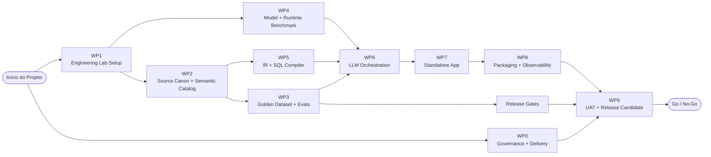

# Plano de Entrega de 8 Semanas

O plano comprimido de 8 semanas deve ser apresentado como um **Working Product with engineering evidence**, não como uma plataforma enterprise totalmente hardened.

## Engineering Workstream Map

## O que reduzimos versus um plano de 12 semanas

A versão de 8 semanas reduz:

- esforço formal de mobilização e project charter;
- amplitude do model/runtime benchmark;
- profundidade de enterprise authentication;
- profundidade de packaging;
- duração de UAT;
- amplitude de documentação;
- hardening para muitas customer topologies.

Ela não deve reduzir:

- lab setup;
- semantic catalog;
- golden dataset;
- eval harness;
- structured IR;
- deterministic SQL compiler;
- SQL validators;
- scoping engine.

## Plano semana a semana

| Semana | Foco | Principais outputs |
|---:|---|---|
| 1 | Kickoff, lab, demo DB, source collection | Lab pronto, DB restaurado, technical plan |
| 2 | Semantic catalog, primeiros golden cases | Catalog v0, test case format |
| 3 | Eval harness, benchmark, IR draft | Eval v0, benchmark baseline, IR schema |
| 4 | Runtime decision, SQL compiler v0 | Model/runtime decision, compiler first cut |
| 5 | Scoping, guardrails, app skeleton | Scope engine, validators, backend/UI skeleton |
| 6 | Integrated NL to IR to SQL flow | End-to-end governed SQL generation |
| 7 | Packaging, concurrency, regression | Deployment kit draft, load tests, bug fixing |
| 8 | UAT, release candidate, handover | UAT report, eval report, release candidate |

## Work packages

| WP | Nome | Owner principal | Duração |
|---|---|---|---|
| WP0 | Governance and delivery setup | Erlon | Dias 1-2 |
| WP1 | Engineering lab setup | Fabio | Semana 1 |
| WP2 | Source canon and semantic catalog | Marcos | Semanas 1-2 |
| WP3 | Golden dataset and eval harness | Marcos/Persival | Semanas 2-3 |
| WP4 | Model/runtime benchmark | Persival | Semanas 2-4 |
| WP5 | IR, semantic layer and SQL compiler | Marcos | Semanas 3-6 |
| WP6 | LLM orchestration and guardrails | Persival | Semanas 4-6 |
| WP7 | Standalone app and auth | Fabio | Semanas 5-7 |
| WP8 | Packaging and observability | Fabio | Semanas 6-8 |
| WP9 | UAT, release candidate and handover | Erlon | Semana 8 |

## Critérios mínimos de Release Candidate

Um release candidate não deve ser declarado sem:

- app rodando standalone no ambiente suportado;
- local model runtime funcionando sem cloud dependency;
- report families Labor Charge e Employee suportadas;
- SQL gerado pelo caminho IR + compiler;
- validators bloqueando DDL/DML e unsafe operations;
- scope rules aplicadas quando exigidas;
- golden dataset rodando end-to-end;
- eval report gerado;
- installation smoke test passando;
- UAT executado com AutoTime SME;
- limitações conhecidas documentadas.
