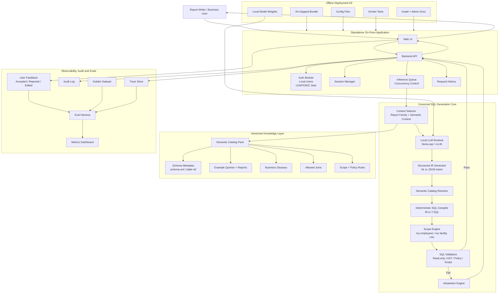

# Detailed Solution Architecture

This reference document describes the logical architecture for the standalone on-premise governed SQL generation product.

For onboarding, start with [../02-architecture/overview.md](../02-architecture/overview.md).

## Architectural layers

### 1. User/Application Layer

- Web UI
- Backend API
- Auth module
- Session manager
- Request history
- Inference queue

### 2. Governed SQL Generation Core

- Context selector
- Local LLM runtime
- Structured IR generator
- Semantic catalog resolver
- Deterministic SQL compiler
- Scope engine
- SQL validators
- Abstention engine

### 3. Versioned Knowledge Layer

- AutoTime schema metadata
- Example queries and reports
- Business glossary
- Allowed joins
- Scope and policy rules
- Semantic catalog pack

### 4. Observability and Evals

- Trace store
- Audit log
- User feedback
- Eval harness
- Golden dataset
- Metrics dashboard

### 5. Offline Deployment Kit

- Air-gapped bundle
- Local model weights
- Config files
- Smoke tests
- Install and admin docs

## Design principle

The LLM should not directly produce final SQL as the trusted output. The LLM should produce a structured intent candidate, and the final SQL should be generated by a deterministic compiler after semantic resolution and scope enforcement.

## Why this matters

This architecture avoids the failure mode of a chatbot that happens to output SQL. The product should behave like a governed compiler-backed assistant, with explicit refusal whenever the request is outside the supported semantic envelope.
