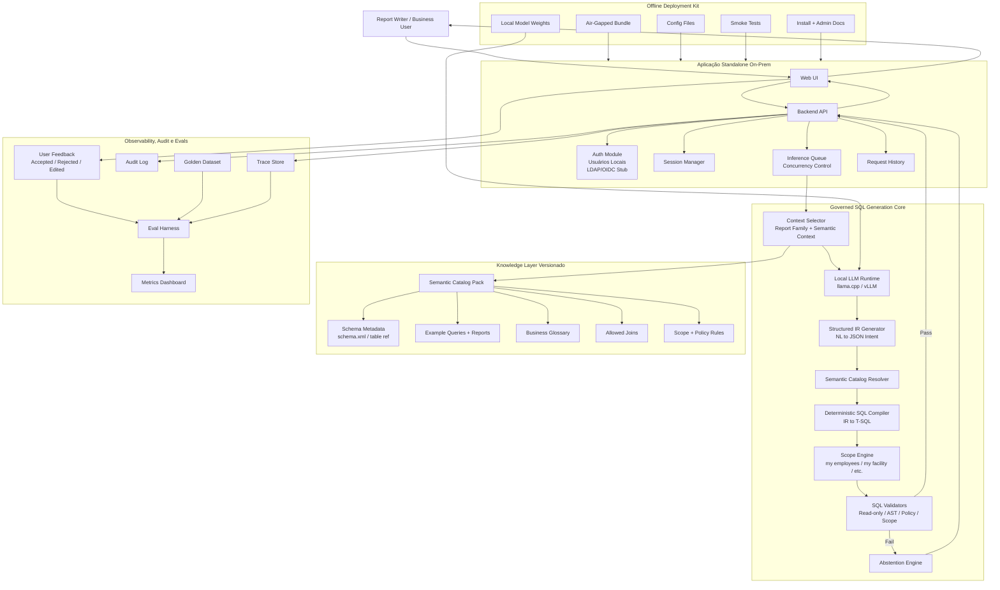

# Arquitetura Detalhada da Solução

Este documento de referência descreve a arquitetura lógica do produto standalone on-premise de governed SQL generation.

Para onboarding, comece por [../02-arquitetura/visao-geral.md](../02-arquitetura/visao-geral.md).

## Camadas arquiteturais

### 1. User/Application Layer

- Web UI
- Backend API
- Auth module
- Session manager
- Request history
- Inference queue

### 2. Governed SQL Generation Core

- Context selector
- Local LLM runtime
- Structured IR generator
- Semantic catalog resolver
- Deterministic SQL compiler
- Scope engine
- SQL validators
- Abstention engine

### 3. Versioned Knowledge Layer

- AutoTime schema metadata
- Example queries e reports
- Business glossary
- Allowed joins
- Scope e policy rules
- Semantic catalog pack

### 4. Observability e Evals

- Trace store
- Audit log
- User feedback
- Eval harness
- Golden dataset
- Metrics dashboard

### 5. Offline Deployment Kit

- Air-gapped bundle
- Local model weights
- Config files
- Smoke tests
- Install e admin docs

## Princípio de design

O LLM não deve produzir diretamente o SQL final como trusted output. O LLM deve produzir um structured intent candidate, e o SQL final deve ser gerado por um deterministic compiler após semantic resolution e scope enforcement.

## Por que isso importa

Essa arquitetura evita o failure mode de um chatbot que por acaso retorna SQL. O produto deve se comportar como um assistente governado, compiler-backed, com explicit refusal sempre que o pedido estiver fora do supported semantic envelope.
