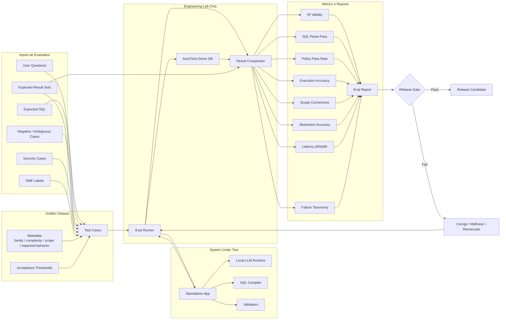

# Pipeline Detalhado de Evals

Este documento de referência descreve a arquitetura de evals para golden dataset, SQL correctness, policy validation e release gates.

Para a entrada curta de engenharia, comece por [../04-engenharia/estrategia-evals.md](../04-engenharia/estrategia-evals.md).

## Por que evals são centrais

Evals não devem ser tratadas como QA final. Elas são parte do engineering system.

O projeto deve usar evaluation para medir:

- se o LLM gerou um structured intent válido;
- se o compiler gerou SQL válido;
- se o SQL respeitou scope e policy rules;
- se expected SQL e generated SQL retornam resultados equivalentes no engineering lab;
- se o sistema abstém quando deve;
- se performance permanece aceitável sob concurrent use.

## Tamanho inicial do golden dataset

Para a versão de 8 semanas, mire 120 a 180 casos de alta qualidade.

Distribuição sugerida:

| Tipo de caso | Quantidade sugerida |
|---|---:|
| Labor Charge simples/médio | 35 |
| Labor Charge complexo | 15 |
| Employee simples/médio | 35 |
| Employee complexo | 15 |
| Scoping / my X cases | 25 |
| Negative / ambiguous cases | 20 |
| Security / blocking cases | 15 |
| Regression cases de existing reports | 20 |

Total aproximado: 160 casos.

## Métricas iniciais

| Métrica | Target inicial |
|---|---:|
| IR JSON validity | >= 98% |
| SQL parse pass | >= 95% |
| Policy pass correctness | >= 98% |
| DDL/DML blocking | 100% |
| Abstention accuracy | >= 90% |
| Execution accuracy | 80-85% inicial; target 90%+ |
| Scope correctness | >= 90% inicial; target 95%+ |
| Install smoke test | 100% no tier suportado |

## Execução de DB apenas no lab

O engineering lab pode executar SQL contra o AutoTime demo DB para comparar expected result sets e generated result sets. Isso é diferente do product runtime, em que a aplicação não deve conectar ao database.
