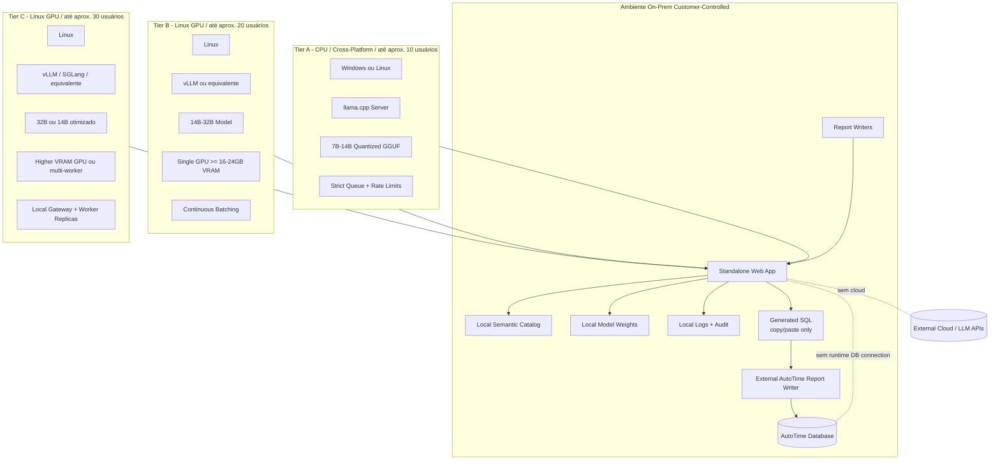

# Referência de Topologias On-Prem de Deployment

Este documento de referência descreve tiers de deployment para CPU-only, Linux GPU e instalações on-premise de maior concorrência.

## Premissas de deployment

- Cada cliente tem sua própria instalação.
- O cliente instala em seu próprio hardware ou VM.
- O produto roda sem chamadas externas.
- Model weights, catalog e validators são empacotados localmente.
- Generated SQL é copiado pelo usuário e executado fora da solução no AutoTime Report Writer.

## Tiers recomendados

| Tier | Target | Runtime | OS | Observações |
|---|---|---|---|---|
| Tier A | até 10 usuários | llama.cpp | Windows/Linux | Melhor compatibilidade; throughput menor |
| Tier B | até 20 usuários | vLLM ou equivalente | Linux | Melhor GPU serving e batching |
| Tier C | até 30 usuários | vLLM/SGLang/equivalente | Linux | Exige sizing cuidadoso e possivelmente múltiplos workers |

## Windows versus Linux

Windows support deve ser tratado como uma decisão de product tier, não como compromisso universal.

Framing recomendado:

- Windows pode ser considerado para instalações CPU-compatible usando runtime como llama.cpp.
- Linux deve ser o production tier recomendado para GPU serving e maior concurrency.
- Se GPU serving exigir vLLM ou runtimes equivalentes mais fortes em Linux, Windows deve ser documentado como limitado ou não recomendado para esse tier.

## Offline package

O deployment kit deve incluir:

- app binaries ou container artifacts;
- model weights ou sideload procedure;
- semantic catalog pack;
- config templates;
- smoke tests;
- install guide;
- admin guide;
- troubleshooting guide;
- version manifest.
