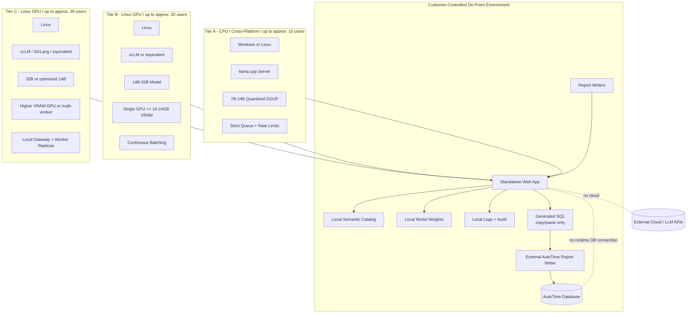

# On-Prem Deployment Topologies

This document describes deployment tiers for CPU-only, Linux GPU and higher-concurrency on-premise installations.

## Deployment assumptions

- Each customer has its own installation.
- The customer installs on its own hardware or VM.
- The product runs without external calls.
- Model weights, catalog and validators are packaged locally.
- Generated SQL is copied by the user and executed outside the solution in AutoTime's Report Writer.

## Recommended tiers

| Tier | Target | Runtime | OS | Notes |
|---|---|---|---|---|
| Tier A | up to 10 users | llama.cpp | Windows/Linux | Best compatibility; lower throughput |
| Tier B | up to 20 users | vLLM or equivalent | Linux | Better GPU serving and batching |
| Tier C | up to 30 users | vLLM/SGLang/equivalent | Linux | Requires careful sizing and possibly multiple workers |

## Windows versus Linux

Windows support should be treated as a product-tier decision, not as a universal commitment.

Recommended framing:

- Windows can be considered for CPU-compatible installations using a runtime such as llama.cpp.
- Linux should be the recommended production tier for GPU serving and higher concurrency.
- If GPU serving requires vLLM or equivalent runtimes that are stronger on Linux, Windows should be documented as limited or not recommended for that tier.

## Offline package

The deployment kit should include:

- app binaries or container artifacts;
- model weights or sideload procedure;
- semantic catalog pack;
- config templates;
- smoke tests;
- install guide;
- admin guide;
- troubleshooting guide;
- version manifest.
