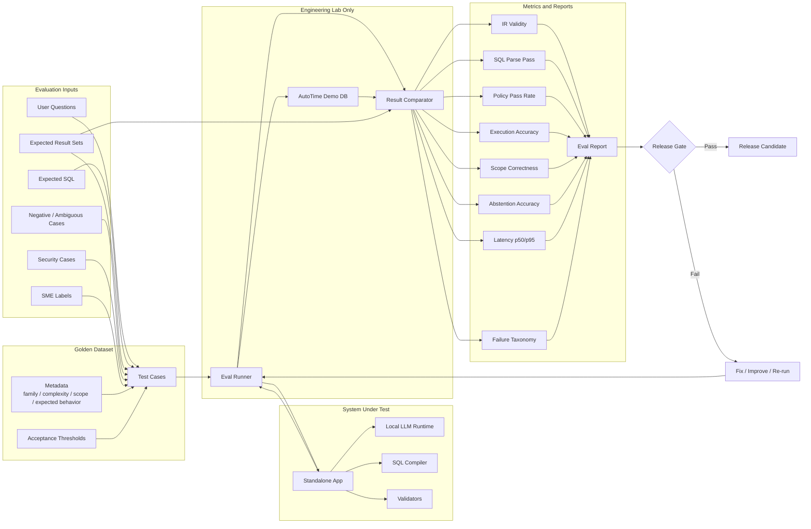

# Evaluation Pipeline

This document describes the evaluation architecture for golden dataset, SQL correctness, policy validation and release gates.

## Why evals are central

Evals should not be treated as final QA. They are part of the engineering system.

The project should use evaluation to measure:

- whether the LLM generated a valid structured intent;
- whether the compiler generated valid SQL;
- whether the SQL respected scope and policy rules;
- whether expected and generated SQL return equivalent results in the engineering lab;
- whether the system abstains when it should;
- whether performance remains acceptable under concurrent use.

## Initial golden dataset size

For the 8-week version, target 120 to 180 high-quality cases.

Suggested distribution:

| Case type | Suggested count |
|---|---:|
| Labor Charge simple/medium | 35 |
| Labor Charge complex | 15 |
| Employee simple/medium | 35 |
| Employee complex | 15 |
| Scoping / my X cases | 25 |
| Negative / ambiguous cases | 20 |
| Security / blocking cases | 15 |
| Regression cases from existing reports | 20 |

Approximate total: 160 cases.

## Initial metrics

| Metric | Initial target |
|---|---:|
| IR JSON validity | >= 98% |
| SQL parse pass | >= 95% |
| Policy pass correctness | >= 98% |
| DDL/DML blocking | 100% |
| Abstention accuracy | >= 90% |
| Execution accuracy | 80-85% initial; target 90%+ |
| Scope correctness | >= 90% initial; target 95%+ |
| Install smoke test | 100% on supported tier |

## Lab-only DB execution

The engineering lab may execute SQL against the AutoTime demo DB to compare expected and generated result sets. This is different from product runtime, where the application should not connect to the database.
