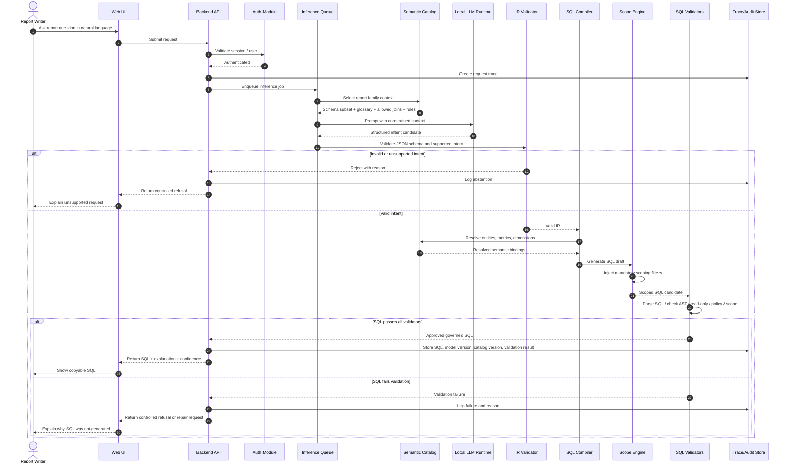

# Runtime Request Sequence

This document describes the end-to-end runtime behavior when a report writer asks a question in natural language.

## Runtime behavior

1. User submits a natural language request.
2. Backend authenticates session.
3. Request is traced.
4. Inference job enters queue.
5. Context selector identifies relevant report family and semantic subset.
6. Local LLM generates a structured intent candidate.
7. IR validator checks JSON schema and supported intent.
8. SQL compiler generates SQL from valid IR.
9. Scope engine injects required filters.
10. Validators check SQL safety, policy and scope.
11. The app returns either governed SQL or controlled refusal.
12. Trace/audit information is stored.

## Non-goals at runtime

- The product does not execute SQL.
- The product does not connect to production DB.
- The product does not call cloud LLM APIs.
- The product does not bypass AutoTime's external Report Writer.
